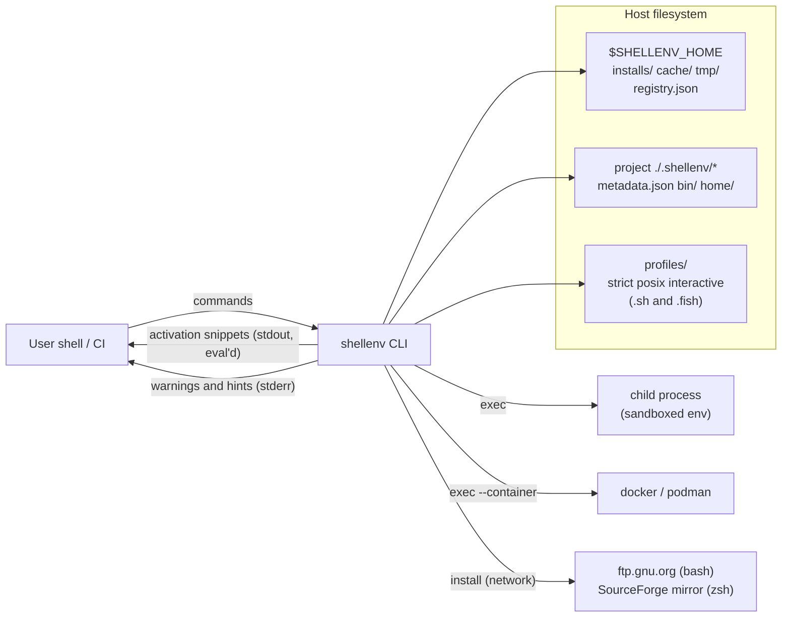
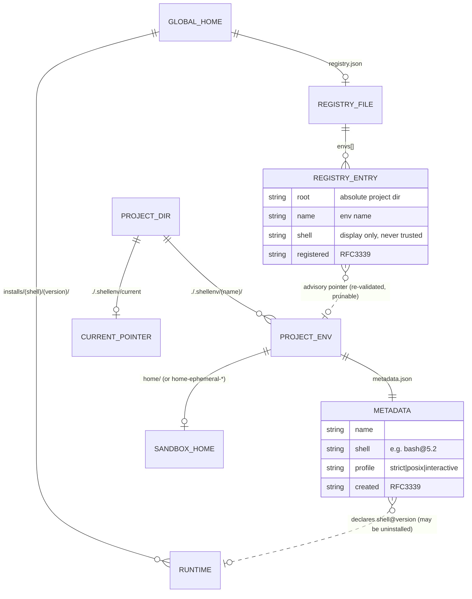
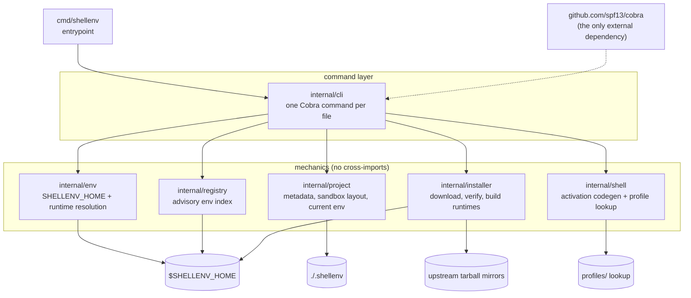
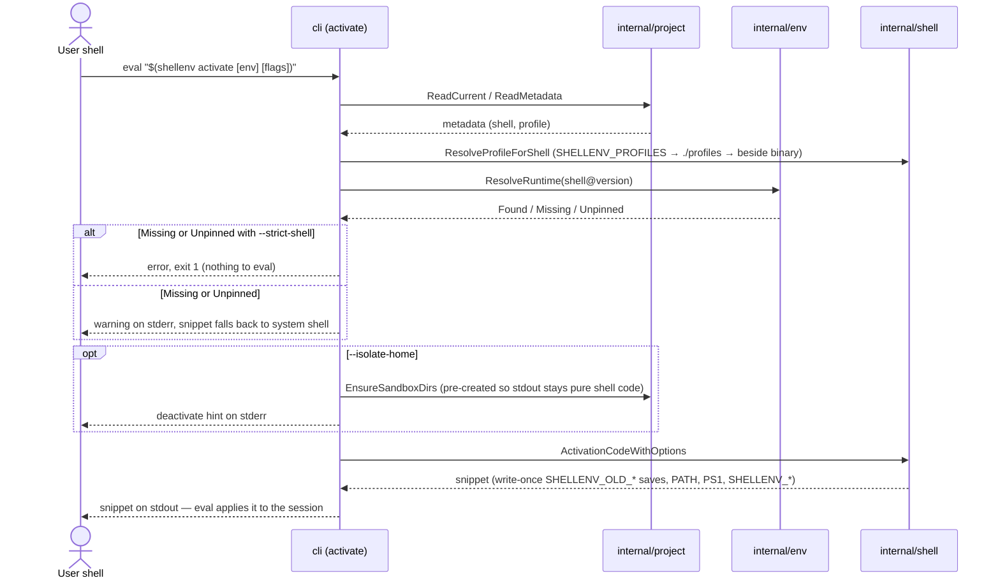
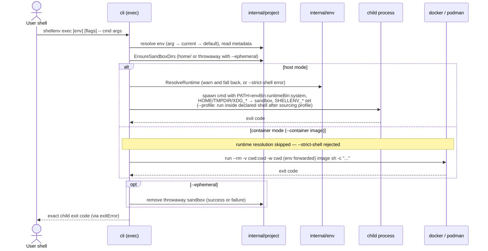
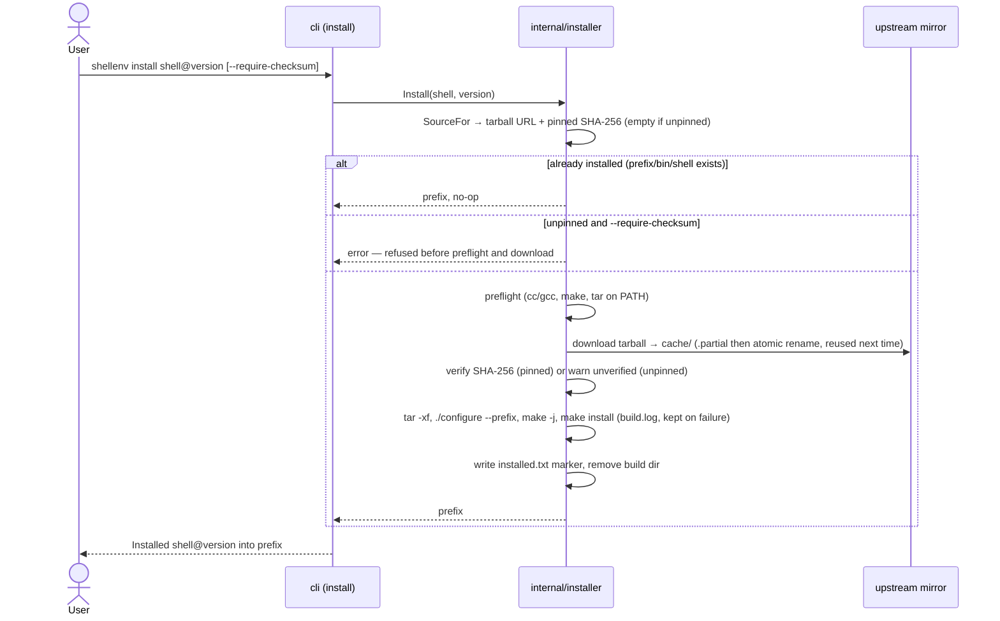
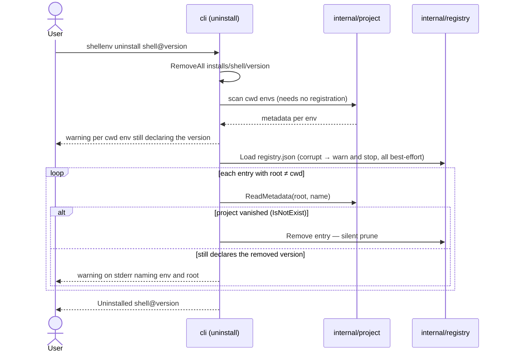
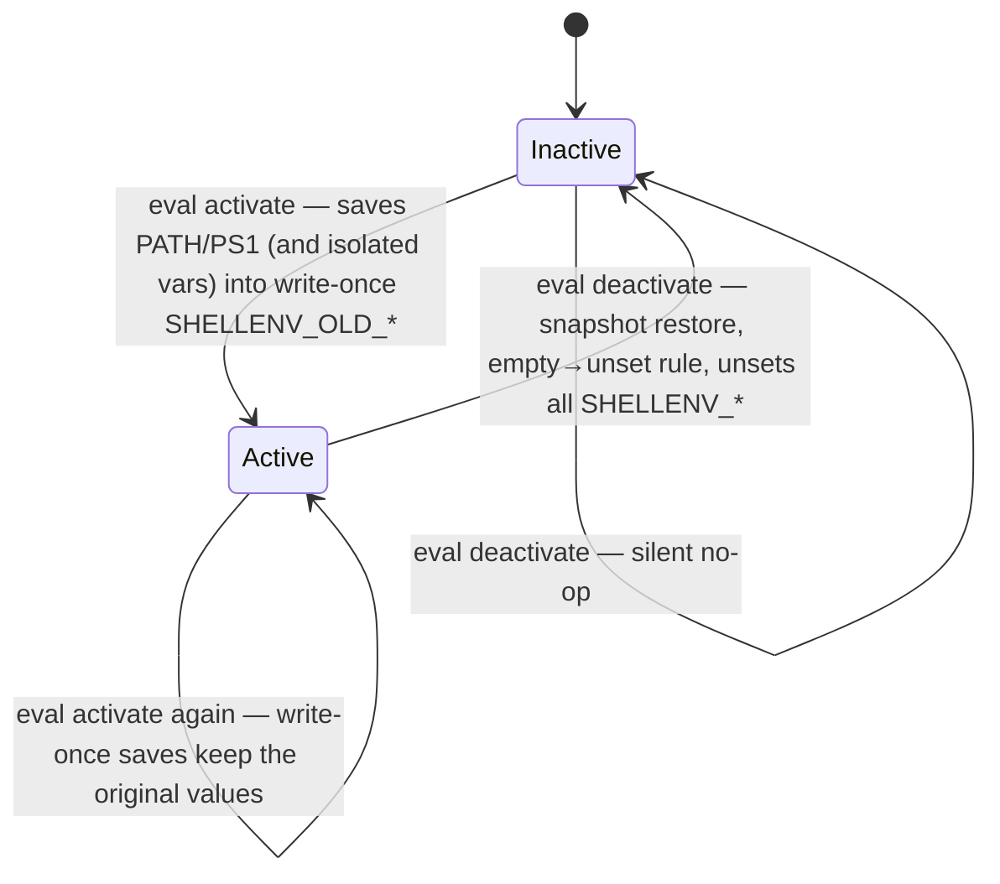

# shellenv Architecture

shellenv provides per-project shell sandboxes so scripts can be exercised against specific shells and option profiles without touching a user's login shell.

For the reasoning behind these choices (and known gaps), see `docs/DESIGN.md`.

## System overview

Everything is driven by one CLI binary over two filesystem state roots (global home + per-project envs). Nothing runs in the background; the only external processes are the child command being exec'd, an optional container engine, and the build toolchain during `install`.

## Isolation model
shellenv is a **user-space sandbox**, not a security sandbox. Its default (host-mode) isolation needs no root, chroot, namespaces, or special syscalls — it is achieved by environment manipulation, confined to the child process (or to the shell session the user opts into via `eval`): `PATH`/runtime pinning, scoped `SHELLENV_*` vars, sourced option profiles, and redirecting `HOME`/`TMPDIR`/`XDG_*` at a per-env sandbox directory. One opt-in mode goes further: `exec --container <image>` delegates to Docker/Podman for real namespace isolation. The mechanisms:

1. **`PATH` shimming**: the env's `bin/` is prepended to `PATH`, so project-local tools shadow system tools. `internal/cli/exec.go` (`prependPath`, `resolveCommandPath`, `isExecutable`) resolves the command manually against that modified `PATH`, honoring the hardened Go 1.19+ rule that ignores the current directory (`.`).
2. **Scoped env vars**: `SHELLENV_ACTIVE=1` and `SHELLENV_ENV_NAME=<env>` are set in the child only — they never persist to the parent unless the user `eval`s the `activate` snippet.
3. **Login shell untouched**: no `.bashrc`/`.zshrc`/`.profile` is read or written. Activation is opt-in (`eval "$(shellenv activate)"`) or one-off (`shellenv exec`).
4. **Sandboxed `HOME`/`TMPDIR`/`XDG_*`**: `exec` always (and `activate --isolate-home` on request) redirects these at a per-env sandbox (`./.shellenv/<env>/home/`), so a script's home and temp writes never land in the real `~`. `deactivate` restores an isolated session from write-once `SHELLENV_OLD_*` snapshots.
5. **Optional shell-option profiles**: `activate` may source a profile (`strict`/`posix`/`interactive`) to enforce shell options like `set -euo pipefail`.
6. **Containerized execution option (`exec --container <image>`)**: when invoked, the command runs inside an isolated Docker/Podman container. The host workspace is mounted (`-v cwd:cwd`) and the working directory matches. The sandbox `$HOME` and `$TMPDIR` are passed as environment variables to keep file writes inside the host's sandbox folder, while providing the container's isolated network, filesystem, and process namespaces.

### What is and isn't isolated
| Concern | Isolated? | Notes |
| --- | --- | --- |
| Binary resolution (`PATH`) | Yes | Env `bin/` wins; system binaries remain reachable as fallback. |
| `SHELLENV_*` vars & prompt | Yes | Set in the child / opted-in session only. |
| Login shell config | Yes | Never read or modified. |
| `HOME` / dotfiles | `exec`, or `activate --isolate-home` | `exec` always redirects `HOME` to a per-env sandbox (`./.shellenv/<env>/home/`); an `eval`'d `activate` session uses the real `~/` unless `--isolate-home` is passed (opt-in; restore with `deactivate`). |
| `TMPDIR` / `XDG_*` | `exec`, or `activate --isolate-home` | Same sandbox and same opt-in as `HOME`. |
| Inherited env vars (secrets) | **No** | `HOME`, `USER`, tokens, etc. pass through unchanged. |
| Filesystem via absolute paths | **No** | `/etc`, `/var`, `/dev`, absolute paths are the real FS. |
| Network | **No** | No network namespace or filtering. |
| Processes | **No** | No PID namespace; host processes are visible. |
| File descriptors / UID | **No** | Child inherits FDs and runs as the same user. |

> [!NOTE]
> **Container Mode Isolation (`exec --container`):** When executing with the `--container <image>` flag, the sandboxed process runs inside a container namespace. Under this mode, filesystems (outside the workspace), network, processes, and file descriptors are fully isolated by the container runtime.

### Intended use vs. non-use
- **Good for**: testing shell scripts against a declared shell/profile, catching portability issues, and iterating without polluting your real shell setup.
- **Not for**: sandboxing untrusted or malicious code. A hostile script can still reach the network, read secrets from the environment, and touch the real filesystem.

## Layout and data
- **Global home** (`SHELLENV_HOME`, default `~/.shellenv`): created by `shellenv init` with `installs/`, `cache/`, and `tmp/`. A `.initialized` marker is written as part of setup. `registry.json` (maintained by `create`/`destroy`) is an advisory index of project env locations used by `uninstall` warnings and `list --all`.
- **Project envs** (`./.shellenv/<env>`): contain `metadata.json`, a `bin/` directory for project-local tools, and optional helper files (e.g., `activate.sh`). `shellenv create` scaffolds this structure; `shellenv use` records the current env in `./.shellenv/current`.
- **Profiles**: sourced shell options under `profiles/` (built-ins: `strict`, `posix`, `interactive`, each with a `.sh` and a `.fish` variant). Overridable via `SHELLENV_PROFILES` or `./profiles/`.

### How the state relates

The two dotted relationships are the deliberately weak ones: a registry entry is advisory (decision 15 — consumers re-read `metadata.json` and prune vanished projects), and a declared runtime may simply not be installed (decision 11 — warn and fall back, or `--strict-shell`).

## Key packages and libraries
- **Cobra (github.com/spf13/cobra)**: command-line framework used to define commands, flags, help text, and dispatch (`rootCmd` + subcommands under `internal/cli`). Each command’s `RunE` returns an error so non-zero exits propagate.
- `cmd/shellenv`: CLI entrypoint calling `cli.Execute()` to run the Cobra root command.
- `internal/cli/*`: Cobra command implementations (`init`, `create`, `activate`, `exec`, `install`, etc.).
- `internal/env`: resolves and prepares `SHELLENV_HOME`; resolves declared shell runtimes under `installs/`.
- `internal/installer`: downloads, verifies, and builds shell runtimes from official source tarballs.
- `internal/project`: per-project metadata reading/writing, env listing, and current-env tracking.
- `internal/registry`: advisory index of project envs under `$SHELLENV_HOME/registry.json` (atomic writes, best-effort semantics — no command fails on registry errors).
- `internal/shell`: activation snippet generation and profile resolution.

### Component diagram

The dependency graph is a strict fan-out: commands live in `internal/cli` and orchestrate five sibling packages that do not import each other. Each sibling owns exactly one concern (and one kind of side effect), which is what keeps them independently testable with plain `t.TempDir()` setups.

## Command flows
- **init**: ensures `SHELLENV_HOME` exists, writes `.initialized`.
- **create**: writes `metadata.json` (name, shell, profile, tools placeholder) and ensures `bin/` exists under `./.shellenv/<env>`.
- **activate**: picks an env (arg → `./.shellenv/current` → `default`), verifies it exists, resolves the profile (`SHELLENV_PROFILES` → `./profiles` → alongside the binary) and the declared shell runtime (`$SHELLENV_HOME/installs/<shell>/<version>/bin`, warning on stderr if declared but missing; `--strict-shell` errors instead), and prints shell code that saves PATH/PS1 into write-once `SHELLENV_OLD_*` vars, sets `SHELLENV_ACTIVE=1`, `SHELLENV_ENV_NAME`, prepends `bin/` (then the runtime bin) to `PATH`, and prefixes the prompt. With `--isolate-home` it also pre-creates the env sandbox (`project.EnsureSandboxDirs`) and redirects `HOME`/`TMPDIR`/`XDG_*` at it (saved the same way).
- **deactivate**: prints guard-everything shell code restoring the session — PATH/PS1 from the `SHELLENV_OLD_*` snapshots, `HOME`/`TMPDIR`/`XDG_*` when they were redirected, then unsets all `SHELLENV_*`. A silent no-op when nothing is active.
- **exec**: uses the same env selection as `activate`, builds a child env with `bin/` prepended (followed by the declared shell's installs bin when resolved — same warning/`--strict-shell` behavior as `activate`) and `SHELLENV_*` vars set, and additionally redirects `HOME`/`TMPDIR`/`XDG_*` to a per-env sandbox (`./.shellenv/<env>/home/`) so scripts don't write to the real home. Under host execution (default), if `--profile` is used, it runs the command *inside* the declared shell after sourcing the env's profile. Under containerized execution (`--container <image>`), it detects the container CLI engine (`docker` or `podman`), mounts the workspace (`-v cwd:cwd`), aligns the working directory, forwards the sandboxed environment variables, and executes the target command wrapped in `sh -c` inside the container to prepend the sandbox `bin/` and source profiles if requested. The child's exit code is mirrored exactly as shellenv's own exit status.
- **install/uninstall/versions**: `install` builds real runtimes from official source tarballs (`internal/installer`: download to `cache/` → SHA-256 verify against pinned checksums, `--require-checksum` refusing unpinned versions → `./configure --prefix=… && make && make install` in `tmp/build-…/` with a `build.log`). Supported: bash, zsh. `uninstall` removes the runtime dir and warns about envs still declaring the version (current directory scan + registry entries re-validated against `metadata.json`, pruning vanished projects); `versions` lists installed ones.
- **which**: resolves a binary with `exec`'s priority — env `bin/`, then the declared runtime's `bin/` (when installed), then `PATH` — so its answer is the binary `exec` would run.
- **destroy/list**: remove or enumerate project envs under `./.shellenv`; both maintain the registry (`destroy` unregisters, `list --all` also shows validated registry entries as `NAME  SHELL  ROOT`).

### Sequence: activate

`activate` never mutates the session itself — it prints shell code for the user to `eval`, which is why stdout must stay pure snippet and every warning goes to stderr.

### Sequence: exec (host and container modes)

### Sequence: install

### Sequence: uninstall (with registry consultation)

### Session lifecycle (activate / deactivate)

Restoration is snapshot-based: however many times you activate, `deactivate` returns the session to its pre-first-activation state. Shell *options* set by a sourced profile (`set -e`, `set -o posix`) cannot be restored from outside the shell.

### Command selection details
- **Env selection**: `activate`/`exec` pick env → CLI arg > `./.shellenv/current` > `default`.
- **Profile lookup**: `SHELLENV_PROFILES` > `./profiles/<name>.sh` > alongside the built binary (`dist/.../profiles`).
- **PATH resolution in exec**: `exec` prepends `<env>/bin` to PATH and resolves the command path manually, honoring the hardened Go 1.19+ rule that ignores the current directory. This ensures project-local shims/binaries run even when the OS PATH search would skip `./`.
- **Fish vs POSIX**: fish activation uses fish env syntax and sources the profile's `.fish` variant when one exists (never the `.sh` file); bash/zsh/posix shells get `SHELLENV_*`, prompt prefix, and optional `.sh` profile sourcing.

## Environment variables
- `SHELLENV_HOME`: global state root (default `~/.shellenv`).
- `SHELLENV_PROFILES`: optional directory override for profile lookup.
- `SHELLENV_ACTIVE`: set to `1` when an env is activated or when using `exec`.
- `SHELLENV_ENV_NAME`: active env name for prompt and debugging.

## Testing
- Unit tests: `make test`.
- Integration tests (require `bats`): `SHELLENV_HOME=$(mktemp -d) bats -r test/integration`.
- A fresh `dist/shellenv` binary is expected for integration runs (`make build`).

## Limitations (current state)
These are known gaps between the tool's intent and its current behavior. Priorities and proposed fixes live in the Roadmap in `docs/DESIGN.md`.

- **`HOME`/`TMPDIR`/`XDG_*` isolation: done (was P0).** `exec` always redirects these to `./.shellenv/<env>/home/`; an `eval`'d `activate` session isolates them only with `--isolate-home` (opt-in, since redirecting HOME mid-session can break prompt frameworks, ssh/git config lookup, and agents keyed on the real home). `deactivate` restores the session; shell options from a sourced profile are not restorable from outside the shell.
- **Declared profile via `exec`: done (was P0).** `shellenv exec --profile -- …` sources the env's profile in the declared shell and runs the command inside it. Opt-in (default off) to preserve `exec` semantics for non-shell commands. Caveat: shell *options* (`set -e`, etc.) apply to commands the profiled shell runs directly, not to interpreters the command re-invokes — enforcing options on an arbitrary spawned script is out of scope for PATH-shimming.
- **Declared shell resolution: done (was P1).** `activate` and `exec` resolve `metadata.json`'s `Shell` (e.g. `bash@5.2`) to `$SHELLENV_HOME/installs/<shell>/<version>/bin` and prepend it to PATH after the env's `bin/`. A declared-but-uninstalled runtime warns on stderr and falls back to the system shell; `--strict-shell` turns that into an error. Resolution is host-only, so `--container` skips it (and rejects `--strict-shell`).
- **Runtime installers: done for bash/zsh (was P1).** `install` builds from official source tarballs with checksum verification (see `docs/DESIGN.md` decision 13). Requires `cc`/`gcc`, `make`, `tar`, and network; other shells (e.g. fish, which needs cmake/rust) still have no installer and error clearly.
- **Fish profiles: done (was P2), with a semantic caveat.** Fish activation sources a fish-syntax variant (`<profile>.fish`) when one resolves; there is no fallback to `.sh`. fish itself has no `set -e`/`pipefail` equivalents, so the strict/posix variants only carry comments and exported variables — use a bash/sh env for option-enforcement testing.
- **Ephemeral cleanup: done (was P2).** `exec --ephemeral` uses a throwaway sandbox home (`./.shellenv/<env>/home-ephemeral-*`) removed after the child exits, success or failure. The persistent `home/` remains the default; `destroy` remains the manual cleanup for whole envs.
- **Robustness (was P2).** A corrupt `metadata.json` warns on stderr (a missing one stays silent); isolation-breach tests cover XDG redirection, ephemeral teardown, and the guarantee that `activate` stdout never overrides `HOME`/`TMPDIR`/`XDG_*`.
